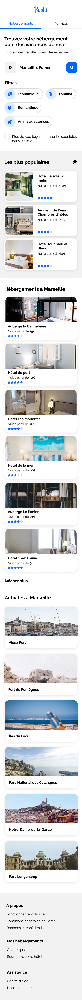
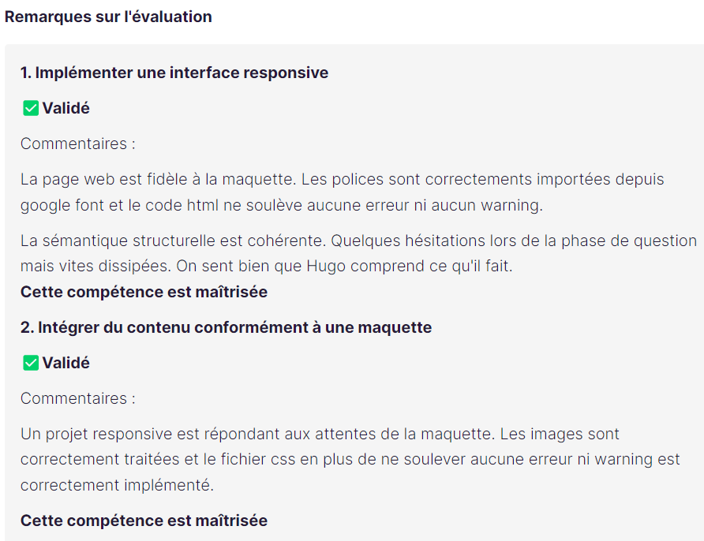
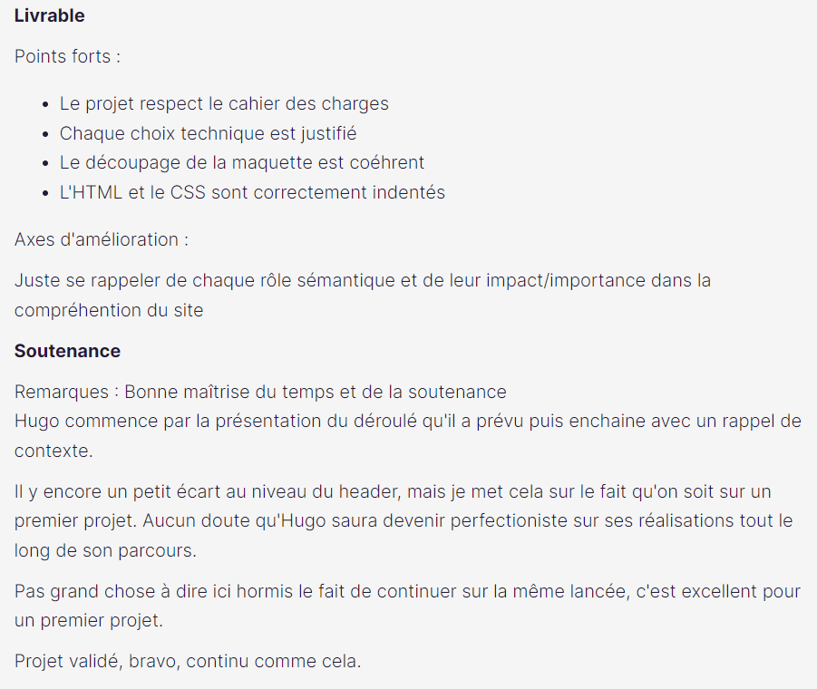

# Booki - Projet d'études

- https://hugo-de-yrigoyen.github.io/booki/
- Dans le cadre des mes études de développeur web
- Page d'accueil d'un site de réservation d'hôtel en **HTML et CSS uniquement** (pas d'autre language, de framework ou de prépocesseur autorisés)

## Contexte

- Instructions :
  https://course.oc-static.com/projects/Front-End+V2/P2+HTML+%26+CSS/DW+P2+-+Specifications+techniques+et+fonctionnelles.pdf
- Maquettes de départ :
  https://course.oc-static.com/projects/Front-End+V2/P2+HTML+%26+CSS/DW+P2+-+Ressources+Booki+FR.zip
  
  

  ## Contexte

- Évalutation réussie
- Commentaires :
  
  
